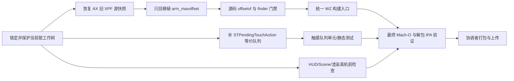

# AX 1.2.8 非授权差异修复执行文档

> 日期：2026-09-20  
> 基线：分支 `lara-wz-clean`，HEAD `db3ff41e1539ae08d0433f306df8c8f82c934323`  
> 文档性质：修复分工、依赖和验收门禁；不代表修复已经完成  
> 参考目标：AX Pro 1.2.8 主二进制 SHA256 `cc947605b97b90d898e784bf73dcab120c44c9281299fe840285dd67dfec1fb4`

## 关键边界

本轮明确不处理授权、卡密、服务端协议、证书策略、授权 Keychain 状态或任何“模拟激活”逻辑。现有相关代码保持原状，修复代理不得为绕过启动门禁而硬编码成功状态。授权系统需要独立测试，不能与本轮 XPF、HUD、触摸、构建和包体验收混在一起。

当前工作树已有未提交修改。所有修复必须在这些修改之上增量进行，不得使用 `git reset --hard`、`git checkout -- <path>`、强制清理或用旧文件整份覆盖当前文件。开始每个工作包前先保存目标文件的状态和差异；发生冲突时只做人工逐块合并。

当前待保护的工作树基线：

```text
 M lara/classes/laramgr.swift
 M lara/funcs/isunsupported.swift
 M lara/kexploit/WZHUDBridge.mm
 M lara/kexploit/utils.m
 M lara/lara.swift
 M lara/views/app/ContentView.swift
 M tests/wz_ax128_launcher_static_test.ps1
 M tests/wz_source_static_test.ps1
?? AX128_FULL_SYNC_PROGRESS.md
?? lara/funcs/DeviceMarketingName.swift
?? tests/wz_hosting_readiness_static_test.ps1
?? tests/wz_scene_lifecycle_static_test.ps1
?? tools/
```

## 执行摘要

当前最高优先级问题是 XPF 仍把 AX 1.2.8 的单 kernelcache ABI 与新版 SPTM/TXM 内部实现混在一起。最终目标不是把 App 侧头文件继续追到新版 `firstItem +0x1a8`，而是把 XPF 整体恢复到 AX 对应的旧布局：`firstItem +0x110`、`ignoreBaseSet +0x118`、单 kernelcache loader，并且只从新版回移植 `arm_maxoffset` finder fallback。

在 XPF 合拢后，必须把王者出包统一到一条构建入口，并对最终 IPA 内的 Mach-O、内嵌 dylib、签名、资源和源码指纹做门禁。触摸侧另行补齐与 `STPendingTouchAction` 等价的有界过期队列，避免主队列阻塞、Scene 切换或后台积压后回放陈旧事件。HUD、Scene 和双渲染后端在真机前必须完成源码、主机测试、iOS 编译、最终二进制和 IPA 五层检查；这些检查通过后仍只能称为“真机前通过”，不能代替王者前台真机验收。

## 范围

| 范围 | 本轮处理 | 说明 |
|---|---:|---|
| AX 旧 XPF ABI、布局和 finder 集 | 是 | 恢复旧源快照，单 kernelcache，只回移植 `arm_maxoffset` |
| XPF 生命周期和字典消费方 | 是 | 复核 `resolvekernoffsets()` 单点 start/stop 与 `xpfitems.m` 消费 |
| 王者构建入口、最终 Mach-O/IPA 门禁 | 是 | 消除旁路出包与陈旧预编译 dylib |
| HUD HID 输入过期队列 | 是 | 对齐 `STPendingTouchAction` 的结构和失效语义 |
| HUD/Scene/渲染真机前验证 | 是 | 静态、主机测试、Xcode 构建、Mach-O、IPA |
| 授权/卡密同步 | 否 | 独立测试后另开工作包 |
| Bundle ID 改成 `com.ax.ax` | 暂不纳入 | 会联动签名、Keychain 和授权数据域 |
| 动态库合并为 AX 单主二进制 | 暂不纳入 | 属于高风险构建架构变化，不影响本轮功能语义门禁 |
| 最低系统精确改为 AX 的 16.5.1 | 暂不纳入 | 需单独决定兼容范围，不能仅为包体相似度收窄支持面 |
| 启动 storyboard、文件共享等 plist 像素级/包体级复刻 | 暂不纳入 | 除非后续证明它影响 Scene/HUD 生命周期 |

## 证据、结论与调用路径

### Evidence

| ID | 观察 | 来源 | 可复核命令 |
|---|---|---|---|
| E-001 | 当前工作树含 8 个已修改路径及多个未跟踪路径，修复必须保留这些改动 | 当前仓库 | `git status --short` |
| E-002 | `vendor/XPF/src/xpf.h` 与 `lara/headers/xpf.h` 均含新版 extra section、SPTM/TXM 字段，`firstItem` 位于这些字段之后 | 两份 XPF 头文件 | `rg -n "kernelBootcodeSection|kernelSandboxAuthStubSection|decompressedSptm|decompressedTxm|firstItem|ignoreBaseSet" vendor/XPF/src/xpf.h lara/headers/xpf.h` |
| E-003 | 已有逆向记录确认 AX 入口是单 kernelcache，`firstItem +0x110`、`ignoreBaseSet +0x118`，且旧 XPF 不含新版三镜像 loader | `AX128_FULL_SYNC_PROGRESS.md` 与 AX 1.2.8 逆向记录 | `rg -n "firstItem|ignoreBaseSet|单 kernelcache|SPTM/TXM" AX128_FULL_SYNC_PROGRESS.md` |
| E-004 | 当前 `xpf.c` 仍包含 `xpf_sptm_txm_init()`；`common.c` 已含 `arm_maxoffset` fallback | XPF 源码 | `rg -n "xpf_sptm_txm_init|arm_maxoffset" vendor/XPF/src` |
| E-005 | 当前静态测试第 227 行把新版字段序列锁成通过条件，方向与 AX 旧布局相反 | `tests/wz_source_static_test.ps1` | `rg -n "decompressedSptm|decompressedTxm|firstItem" tests/wz_source_static_test.ps1` |
| E-006 | `build_ipa_wz.sh` 会源码重编 XPF，但源码基线仍是新版；普通 `build_ipa.sh` 和 `ipabuild.sh` 可绕过完整 WZ 门禁 | 三条构建路径与 CI | `rg -n "build_ipa_wz|xcodebuild|libxpf" scripts .github ipabuild.sh` |
| E-007 | AX 暴露 `STPendingTouchAction` 的 `_pointerID`、`_kind`、`_expirationTime` 和 `_actionBlock` | `F:/逆向/王者荣耀/.ax128/AX_v1.2.8_objc_dump.txt` | `rg -n -A 14 "STPendingTouchAction" F:/逆向/王者荣耀/.ax128/AX_v1.2.8_objc_dump.txt` |
| E-008 | 当前 HUD HID 回调解析事件后直接 `dispatch_async` 到主队列，没有按 pointer/kind/expiration 管理待执行动作 | `lara/kexploit/WZHUDBridge.mm` | `rg -n -A 35 "static void hid_event_callback" lara/kexploit/WZHUDBridge.mm` |
| E-009 | 当前渲染已覆盖 CA/Metal 双后端，但已有覆盖表明确说明尚未进行 iOS 构建和真机像素比对 | `tests/AX128_GDR_METHOD_COVERAGE.md` | `rg -n "双后端等价边界|未进行iOS构建" tests/AX128_GDR_METHOD_COVERAGE.md` |
| E-010 | 当前工程仍以动态方式嵌入 `libxpf.dylib`、`libgrabkernel2.dylib`，Bundle ID 为 `com.roooot.lara`，部署目标为 16.0 | Xcode 工程 | `rg -n "libxpf|libgrabkernel2|PRODUCT_BUNDLE_IDENTIFIER|IPHONEOS_DEPLOYMENT_TARGET" lara.xcodeproj/project.pbxproj` |

### Findings

| ID | 等级 | 状态 | 结论 | 证据 | 置信度 |
|---|---|---|---|---|---|
| F-001 | P0 | validated | 当前 XPF 是旧入口 ABI 与新版内部结构/finder 的混搭；继续只改声明或偏移会复发崩溃 | E-002、E-003、E-004、E-005 | 高 |
| F-002 | P0 | validated | 现有构建路径可以产出不同语义的 IPA，且当前门禁没有验证最终 dylib 的实际 `gXPF` 字段访问偏移 | E-005、E-006 | 高 |
| F-003 | P1 | validated | HUD 输入具备指针生命周期状态，但缺少 AX 对应的待处理动作过期/丢弃层 | E-007、E-008 | 高 |
| F-004 | P1 | validated | HUD、Scene、渲染现状只有源码级证据，缺少当前工作树对应的 iOS 构建和最终 IPA 证据 | E-001、E-009 | 高 |
| F-005 | P2 | validated | 存在包体级差异，但 Bundle ID、部署目标和单二进制化会扩大风险，不应与本轮功能修复绑定 | E-010 | 高 |

### Path



## 建议分工与依赖

| 工作包 | 建议负责人 | 可并行性 | 输入依赖 | 交付物 |
|---|---|---|---|---|
| WP-A：旧 XPF 恢复 | 修复代理 A | 第一优先 | 当前逆向证据、旧二进制/旧字段清单 | 旧布局源码、唯一 backport、XPF 布局测试 |
| WP-B：构建统一和最终产物门禁 | 修复代理 B | 可先设计，合入依赖 WP-A | WP-A 冻结的 ABI/布局 | 单一构建入口、Mach-O/IPA verifier、CI 门禁 |
| WP-C：触摸过期队列 | 修复代理 C | 可与 WP-A 并行 | AX ObjC 元数据、当前 HID callback | 队列实现、假时钟测试、Scene 清理验证 |
| WP-D：集成复核 | 协调者或审计代理 | 必须最后 | WP-A、WP-B、WP-C | 变更审计、完整测试结果、残余风险表 |
| WP-E：打包与上传 | 仅协调者 | 最后执行 | WP-D 全部通过 | IPA、JSON 清单、SHA256、上传链接/结果 |

修复代理不得自行上传、发布或替协调者生成正式发布；授权/卡密不分配给任何本轮代理。

## WP-A：恢复 AX 1.2.8 旧 XPF

### 目标状态

1. `xpf_start_with_kernel_path` 的声明、实现和全部调用只有一个 `kernelPath` 参数。
2. `XPF` 在 arm64/arm64e ABI 下满足：
   - `offsetof(XPF, firstItem) == 0x110`
   - `offsetof(XPF, ignoreBaseSet) == 0x118`
   - 结构整体按 8 字节对齐，预期 `sizeof(XPF) == 0x120`
3. XPF 只装载和解析单个 kernelcache，不初始化 SPTM/TXM 镜像或注册其 finder。
4. 旧 XPF finder 集和字段清单整体恢复；不得只删除 `decompressedSptm`/`decompressedTxm` 两段字段。当前布局还包含 AX 旧快照中不存在的 section 字段，头文件单点删字段会造成新的 ABI 漂移。
5. 唯一从新版回移植的功能修复是 `xpf_find_pmap_bootstrap()` 在找不到 `pmap_asid_plru` 时回退搜索 `arm_maxoffset`。不得顺带带入 9e12b8f 的 SPTM/TXM loader、支持判断、section 扩展或其他 finder 改写。

### 推荐实施顺序

1. 先确定旧源基线。优先使用能与 AX 随包旧 `libxpf.dylib` 导出、字符串、finder 注册面和布局同时匹配的上游旧快照。`F:/逆向/王者荣耀/源码/源码-cf/lara/headers/xpf.h` 可作为旧字段顺序的旁证，但它缺少 AX 已确认的 `ignoreBaseSet`，不能直接整份复制为最终头文件。
2. 对旧源做独立比对：入口参数、`XPF` 字段顺序、注册的 sets/items、`xpf_stop()` 清理范围。旧源快照身份未确认前，不进入回移植。
3. 整体替换 `vendor/XPF/src` 中与版本绑定的源码，而不是在当前新版源码上逐项注释。外部依赖只保留旧源实际需要的部分。
4. 在旧 `common.c` 上单独应用 `arm_maxoffset` fallback 小补丁，并以独立 diff 审查，确认无其他 9e12b8f 逻辑进入。
5. 同步 `lara/headers/xpf.h` 的公开声明和 `XPF` 字段，保留 Lara 自己确有消费方的 helper，但 helper 不得改变结构布局。
6. 修正 `tests/wz_source_static_test.ps1`：删除“必须包含 SPTM/TXM 新字段”的反向断言，改为旧字段白名单、禁止字段黑名单和编译期 `offsetof` 门禁。
7. 复核所有消费方，尤其是 `lara/kexploit/xpfitems.m`、`lara/kexploit/offsets.m`、`lara/kexploit/utils.m` 和 XPF CLI。

### 涉及文件

- `vendor/XPF/src/xpf.h`
- `vendor/XPF/src/xpf.c`
- `vendor/XPF/src/common.c`
- `vendor/XPF/src/ppl.c`
- `vendor/XPF/src/non_ppl.c`
- `vendor/XPF/src/bad_recovery.c`
- `vendor/XPF/src/sptm_txm.c`、`vendor/XPF/src/sptm_txm.h`（从构建和初始化链移除；是否删除文件由旧源快照决定）
- `vendor/XPF/src/cli/main.c`
- `vendor/XPF/Makefile`
- `lara/headers/xpf.h`
- `lara/kexploit/xpfitems.m`
- `lara/kexploit/offsets.m`
- `lara/kexploit/utils.m`
- `tests/wz_source_static_test.ps1`
- 建议新增 `tests/xpf_ax128_layout_test.c` 或等价编译期测试

### 必须新增的门禁

源码编译期门禁示意：

```c
#include <stddef.h>
#include "../lara/headers/xpf.h"

_Static_assert(offsetof(XPF, firstItem) == 0x110, "AX 1.2.8 firstItem ABI");
_Static_assert(offsetof(XPF, ignoreBaseSet) == 0x118, "AX 1.2.8 ignoreBaseSet ABI");
_Static_assert(sizeof(XPF) == 0x120, "AX 1.2.8 XPF size");
```

同时要求：

- 源码拒绝 `xpf_sptm_txm_init`、三参数入口和 `XPF` 中 SPTM/TXM 字段。
- 最终 `libxpf.dylib` 必须包含 `arm_maxoffset`。
- 最终 `libxpf.dylib` 不得导出或包含 SPTM/TXM 初始化路径；只对该 dylib 做检查，不能因固件获取层仍出现 `sptm.im4p`/`txm.im4p` 而误报。
- 最终 dylib 反汇编或结构化 Mach-O 检查必须证明 `xpf_item_register`/`xpf_item_resolve` 使用 `gXPF + 0x110`，`xpf_set_ignore_base_set` 使用 `gXPF + 0x118`。仅比较两份头文件文本不算通过。
- 用已知 kernelcache fixture 运行旧三组字典集合 `base`、`translation`、`physmap`；至少验证关键 item 能解析或输出真实 finder 错误，不允许用空错误串覆盖原因。

### 验收标准

- 两份公开头文件的字段序列完全一致，编译期 offset/size 三条断言通过。
- `rg -n "decompressedSptm|decompressedTxm|xpf_sptm_txm_init" vendor/XPF/src lara/headers/xpf.h` 对生产链无命中。
- 单参数 ABI 检查通过，全部调用方无多参数变体。
- `arm_maxoffset` fallback 的独立 diff 只触及目标 finder。
- 最终 dylib 二进制门禁确认 `+0x110/+0x118`，不是只在测试源码里出现常量。
- XPF start/stop 重复两轮不保留旧 item、fd、mmap 或错误状态。

### 回滚点

- A0：当前工作树和 `vendor/XPF` 原始差异快照。
- A1：未经 `arm_maxoffset` 回移植的已确认旧源基线。
- A2：只含 `arm_maxoffset` 小补丁、但尚未接入 App 的 XPF。
- A3：App 头文件和消费方已同步、全部 XPF 测试通过的集成点。

如果 A2 失败，回到 A1 重新核对旧源身份，禁止继续在混合源码上叠补丁。

## WP-B：统一构建路径并加固最终 Mach-O/IPA 门禁

### 目标状态

`scripts/build_ipa_wz.sh` 是唯一可发布王者 IPA 的入口。`.github/workflows/build.yml`、本地说明和任何兼容入口最终都调用同一套 preflight、XPF build、Xcode build、签名、IPA verify 和 manifest 逻辑。`scripts/build_ipa.sh`、`ipabuild.sh` 若不能安全委托该入口，应明确拒绝用于 WZ 发布，不能继续静默产出缺门禁的包。

### 构建链改造

1. 把静态/主机测试放在 XPF 和 Xcode 构建之前；任何失败都不得产生可上传 IPA。
2. 将 XPF 编译到构建目录，避免无提示覆盖受版本控制的 `lara/lib/libxpf.dylib`。Xcode 链接和 Embed Frameworks 必须消费这份本轮生成物。
3. 固定 ChOma/XPF 所需依赖的提交或校验值。当前缺依赖时浅克隆默认分支会使同一源码产生不同结果，不符合可复现出包要求。
4. `SOURCE_COMMIT` 之外再写入工作树内容指纹与 dirty 状态。当前工作树有未提交改动，只记录 HEAD 会把不同源码误标成同一包。
5. 在打 zip 前验证 `.app`，打 zip 后再次解包到临时目录验证最终 IPA；两次验证必须共享同一个 verifier。
6. 只有最终 IPA verifier 通过后才生成发布清单；清单记录 IPA、主 Mach-O、`libxpf.dylib`、`libgrabkernel2.dylib` 的 SHA256、架构、源码提交和工作树指纹。

### 最终产物门禁

| 对象 | 必查项 | 通过条件 |
|---|---|---|
| 主 Mach-O | 架构、依赖、runpath、关键 marker | 目标架构正确；只从 `@executable_path/Frameworks`/批准 runpath 加载内嵌 dylib；HUD/Scene/触摸关键路径存在 |
| `libxpf.dylib` | SHA256、install name、导出、字符串、字段访问 | 与本轮源码构建物摘要一致；含 `arm_maxoffset`；无 SPTM/TXM 初始化；实际访问 `+0x110/+0x118` |
| 签名 | 主程序和嵌入 dylib | 所有嵌入代码对象均可校验；主程序含 HUD 所需 entitlement |
| Info.plist | 源码身份、Scene/方向、版本 | `LARABuildSourceCommit`、内容指纹、dirty 状态与清单一致；运行所需配置存在 |
| 资源 | 字体、图标、AXReference | 文件存在且摘要符合仓库基线 |
| IPA | 结构和清单 | 仅一个预期 `Payload/*.app`；解包后复验全部通过；清单 SHA 与实际文件一致 |

推荐将门禁实现为单独的只读脚本，例如 `scripts/verify_wz_ipa.sh` 和 `tools/verify_xpf_layout.py`，并让 CI、本地构建和协调者上传前复用，避免三套不同断言。

### 涉及文件

- `scripts/build_ipa_wz.sh`
- `scripts/build_ipa.sh`
- `ipabuild.sh`
- `.github/workflows/build.yml`
- `lara.xcodeproj/project.pbxproj`
- `README.md`
- `tests/wz_source_static_test.ps1`
- 建议新增的最终产物 verifier 与对应测试

### 验收标准

- 所有公开 WZ 出包入口都汇合到同一脚本或明确 fail-closed。
- 清洁构建不会修改受版本控制的预编译 dylib。
- CI 在 build 前运行与本地相同的检查集。
- 最终 IPA 解包后的 `libxpf.dylib` 与本轮生成物 SHA256 相同，并通过实际字段偏移验证。
- manifest 能区分同一 HEAD 下不同未提交工作树的包。
- 上传步骤只消费 verifier 已盖章的 IPA 和 JSON 清单。

### 回滚点

- B0：保留现有 `build_ipa_wz.sh` 可运行副本和门禁清单。
- B1：只抽出 verifier，尚未更改构建入口。
- B2：canonical build 已接 verifier，但普通入口尚未改道。
- B3：所有入口和 CI 已统一。

如构建统一失败，只回退入口路由；保留独立 verifier，不回退 WP-A 的已验证 XPF。

## WP-C：补齐 `STPendingTouchAction` 等价过期队列

### 已知契约与未知量

已知 AX 对象至少包含 `pointerID`、`kind`、`expirationTime` 和 `actionBlock`。当前源码已经声明 `pathIdentity`，但 HID 回调没有把它用于队列身份；事件被直接投递主队列。AX 的准确超时时长、同指针 move 是否合并、终止事件如何抢占等常量尚未在现有文档中形成独立证据，修复代理应先从 AX 调用点补证，不得把猜测常量写成“原版值”。

### 最小等价语义

1. HID callback 只负责解析并生成不可变 pending action，不直接更改 UI/HUD 状态。
2. action 至少保存：AX `pathIdentity` 映射出的 `pointerID`、phase/kind、捕获点位、单调时钟 `expirationTime`、Scene/hosting generation、执行 block。
3. 所有 enqueue/dequeue 在单一串行执行域内完成；UI action 最终在主队列执行，但执行前再次检查 expiration 和 generation。
4. 已过期、Scene 已断开、HUD 已销毁、hosting generation 已变化的 action 必须丢弃，不能在重连后回放。
5. Begin/Move/End/Cancel 对同一 pointer 保持顺序；End/Cancel 必须完成 active pointer 清理。若 AX 证据证明 move 可合并，只允许合并同 pointer、同 generation 的尚未过期 move。
6. capture-kill-point 与普通 HUD 交互必须走同一 pending 层，避免一个分支绕过过期检查。
7. shutdown/scene disconnect 清空队列并递增 generation；旧 block 即使已经进入主队列也应在执行前失效。

### 建议结构

可使用 Objective-C 对象复刻 `STPendingTouchAction`，也可用内部 C++/Objective-C++ 值类型；命名不要求相同，但四项状态和行为必须可测试。若新增类，优先放在独立的 `WZHUDPendingTouchAction.{h,mm}`，避免继续扩大 `WZHUDBridge.mm` 的职责。

### 涉及文件

- `lara/kexploit/WZHUDBridge.mm`
- 可能新增 `lara/kexploit/wz/WZHUDPendingTouchAction.h`
- 可能新增 `lara/kexploit/wz/WZHUDPendingTouchAction.mm`
- `lara.xcodeproj/project.pbxproj`
- `tests/wz_ax_touch_static_test.ps1`
- 建议新增 `tests/wz_pending_touch_queue_test.mm` 或可在主机运行的纯 C++ policy 测试
- `tests/wz_scene_lifecycle_static_test.ps1`

### 必测场景

| 场景 | 预期 |
|---|---|
| 同 pointer 的 Begin→Move→End | 顺序执行一次，最终无 active pointer |
| action 排队期间超过 expiration | 不执行 block，不改变面板/捕获状态 |
| Scene disconnect 后旧 action 到达主队列 | 因 generation 不匹配而丢弃 |
| hosting 重建后旧 action 到达 | 不作用于新窗口 |
| 多 pointer 输入 | 按 pointer 分离，不相互清理；若产品仍只允许单 pointer，应明确 fail-closed |
| Cancel | 清理 active pointer、恢复交互几何，不触发控件 action |
| 主队列短时阻塞 | 新 action 不无限堆积，恢复后过期项被丢弃 |
| capture kill point 过期 | 不保存陈旧坐标 |

测试必须使用可注入的假单调时钟，禁止依赖真实 sleep 造成不稳定结果。

### 验收标准

- 源码中存在结构化 pending action 和集中式 enqueue/drain/clear 路径。
- `pathIdentity` 或由 AX 证据确认的等价字段真实进入 `pointerID`。
- expiration 和 generation 在“入队时”和“执行前”均有明确检查。
- 上述场景的自动化测试通过。
- `wzhud_destroy`、Scene disconnect、hosting 失效均能清空队列并使已派发 block 失效。

### 回滚点

- C0：保持现有 HID callback 行为的基线 diff。
- C1：只引入纯数据结构和测试，不接 callback。
- C2：接入 enqueue/drain，但保留可局部撤销的调用替换。
- C3：Scene/hosting 清理联动完成。

## WP-D：HUD、Scene、渲染真机前验证

### 验证原则

验证结果必须绑定最终合并后的源码；任一源码变化后旧结果失效。源码静态检查、主机单元测试、iOS 编译、Mach-O 检查和真机测试必须分别报告，不能把其中一种写成另一种通过。

### 第 1 层：工作树和静态契约

在最终合并状态运行并保存输出：

```powershell
./tests/wz_source_static_test.ps1
./tests/wz_hosting_readiness_static_test.ps1
./tests/wz_scene_lifecycle_static_test.ps1
./tests/wz_ax128_launcher_static_test.ps1
./tests/wz_ax128_ui_static_test.ps1
./tests/wz_ax_touch_static_test.ps1
./tests/wz_ax_exposure_test.ps1
./tests/wz_fresh_root_test.ps1
git diff --check
```

`wz_source_static_test.ps1` 必须先修正旧 XPF 布局方向，否则当前“通过”会把错误新版布局继续锁住。

### 第 2 层：主机可执行测试

构建并运行仓库中所有与本轮路径相关的 C/C++ 测试，至少覆盖：

- `wz_ax_touch_policy_test.cpp`
- `wz_ax_auto_consumer_test.cpp`
- `wz_ax_feature_rules_test.cpp`
- `wz_ax_monster_policy_test.cpp`
- `wz_ax_actor_cache_test.cpp`
- `wzmem_partial_test.c`
- 新增的 XPF layout test
- 新增的 pending touch queue test

测试命令应集中在一个脚本中并由 CI 调用，不能靠人工挑选。

### 第 3 层：iOS 编译与链接

- 以 canonical WZ build 执行 Release 的 generic iOS build。
- 检查 `WZHUDBridge.o`、`WZAXTouch.o`、Scene delegate 和 XPF consumer 确实参与本轮编译。
- 将 warning 当作审计输入；涉及生命周期、Block capture、Objective-C selector、签名和 ABI 的 warning 必须归零。
- 确认最终主程序仅引用本轮生成且已嵌入的 dylib。

### 第 4 层：最终 Mach-O 可执行检查

最终主 Mach-O 至少检查：

- 本地 draw/menu 双窗口类和 hosting readiness 路径存在。
- Scene foreground/background/disconnect/reconnect selector 与 epoch 清理标记存在。
- CA 和 Metal 两套 renderer 入口均被链接，不能只在源码中存在而被裁掉。
- HID monitor、`IOHIDEventSystemClientDispatchEvent`、pending touch drain/expiration marker 均存在。
- 已退役的 helper/spawn/旧三窗口路径不在最终二进制。
- entitlement、runpath、dylib install name 和目标架构正确。

字符串 marker 只能证明代码片段进入二进制，不能单独证明行为；关键 XPF 偏移必须使用反汇编/结构化分析验证。

### 第 5 层：fixture 渲染检查

在不依赖真机内存读取的固定 fixture 上，分别驱动 CA 与 Metal 后端，比较：

- 相同快照产生的图元数量、类别、坐标和颜色；
- Scene inactive/active 切换时后端选择和可见性；
- 空快照、16/19/20 槽怪物、头像下载失败、文字边界和方向切换；
- renderer 销毁后无延迟 block 重新操作旧 layer/view。

像素截图比较可作为补充，但当前 Metal 是纹理 quad 路径，不应把“图元等价”宣称为“原 ImGui 像素一致”。

### 真机前通过标准

- 五层检查全部绑定同一个工作树指纹和 IPA SHA256。
- 无静态门禁失败、无主机测试失败、Release iOS build 成功、最终 Mach-O/IPA verifier 成功。
- 测试报告明确标注“未执行真机王者前台验证”。

真机仍需后续验证：冷启动不闪退、XPF 字典解析、Lara→王者切换后 HUD 可见、菜单触摸、自动触摸、前后台、Scene 断开重连、连续帧率和像素截图。未完成这些步骤前不得称“AX 1.2.8 完全对齐”。

## 包体级差异决策

### 本轮纳入

- 最终 IPA 内必须是本轮构建的旧布局 `libxpf.dylib`，禁止陈旧预编译库。
- 主程序到 Frameworks 的 load command、runpath、dylib install name 必须可在设备解析。
- 主程序和所有嵌入 dylib 的架构、签名、entitlement 必须一致且可校验。
- Rajdhani 字体、图标、`AXReference.bundle` 及 HUD 所需资源必须存在并核摘要。
- Info.plist 中影响 Scene、方向和运行的键纳入行为验收。
- IPA 结构、源码提交、工作树内容指纹、dirty 状态、二进制摘要和目标 UUID 纳入 JSON 清单。

### 暂不纳入

- `com.roooot.lara` 改为 `com.ax.ax`：授权/Keychain 未进入本轮，提前修改会改变数据域和签名行为。
- 部署目标从 16.0 精确改为 16.5.1：需要单独的兼容性决策和设备矩阵。
- 把 `libxpf.dylib`、`libgrabkernel2.dylib` 静态合并进主二进制：风险与收益不成比例，当前先保证动态装载正确。
- `UILaunchStoryboardName=LaunchScreen`、文件共享、全屏键和所有 plist 顺序/冗余项的 1:1 复刻：不影响已定义的核心验收时暂缓；若 Scene 证据证明相关，再单独纳入。
- 原 Assets.car 的完全直接消费、字体栅格、抗锯齿和 ImGui 三角化的逐像素复刻：本轮只做资源完整性和功能等价验证。
- 授权/卡密的任何包体资源、URL、Keychain service、证书或状态 schema。

## 合并顺序

1. 协调者记录工作树基线，不清理现有修改。
2. WP-A 恢复旧 XPF并冻结 ABI；WP-C 可同时进行，但不得碰 XPF 和构建脚本。
3. WP-A 的 layout/finder 测试通过后，WP-B 接入最终 dylib/Mach-O/IPA 门禁。
4. 合并 WP-C，补跑 Scene/HUD/touch 全套测试。
5. WP-D 做跨文件审计，确认测试和 verifier 没有只匹配注释或测试夹具。
6. 协调者在同一工作树上执行 canonical build、解包复验、记录 SHA256。
7. 只有所有门禁通过后，协调者上传 IPA 和 JSON 清单；上传结果与具体 SHA256 绑定。

## 全局验收清单

- [ ] 未覆盖或丢失基线未提交修改。
- [ ] 授权/卡密代码没有被修改，也没有加入假激活或绕过。
- [ ] `firstItem +0x110`、`ignoreBaseSet +0x118` 同时由编译期和最终 dylib 证据确认。
- [ ] XPF 为单 kernelcache，生产初始化链无 SPTM/TXM。
- [ ] `arm_maxoffset` 是唯一明确从新版回移植的 finder 修复。
- [ ] `wz_source_static_test.ps1` 不再把新版 XPF 字段作为正确条件。
- [ ] 所有 WZ 构建入口统一或 fail-closed。
- [ ] pending touch 具备 pointer/kind/expiration/action/generation 语义和假时钟测试。
- [ ] HUD、Scene、CA/Metal、触摸、XPF 的静态与主机测试全部通过。
- [ ] Release iOS build 和最终 Mach-O/IPA verifier 通过。
- [ ] IPA/JSON 的 SHA256、源码提交和工作树内容指纹一致。
- [ ] 报告明确列出尚未执行的真机和像素验证，不把静态通过写成真机通过。

## 失败处理

- 同一问题连续两次修复无效，停止继续叠补丁，回到最近回滚点复核旧源身份、ABI 假设或测试有效性。
- 任何 offset 检查只在源码通过、二进制失败时，优先判定实际编译源或链接产物错误，不放宽门禁。
- 任何最终 IPA 与中间 `.app` 摘要不一致时，停止上传，检查打包和签名步骤。
- 触摸测试偶现超时不允许用延长 sleep 掩盖，必须用假时钟和串行队列状态定位。
- 真机失败时保留对应 IPA、JSON、日志和 SHA256，不用新的未标识包覆盖证据。

## 当前文档阶段未执行事项

本文档编写阶段未修改源码、测试、构建脚本或二进制，未运行测试、构建、签名、打包、真机验证、提交、推送或上传。文中命令均为后续修复和验收步骤，不是已通过声明。
